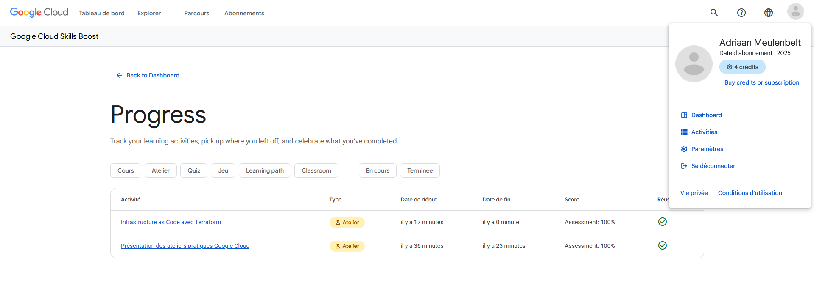
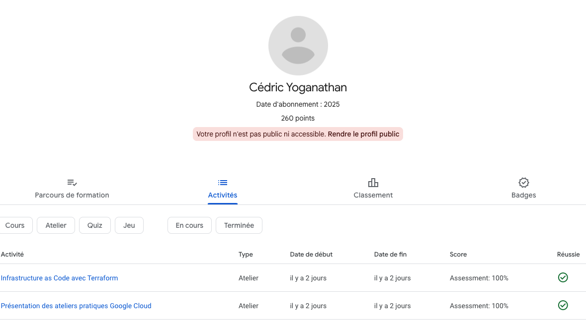
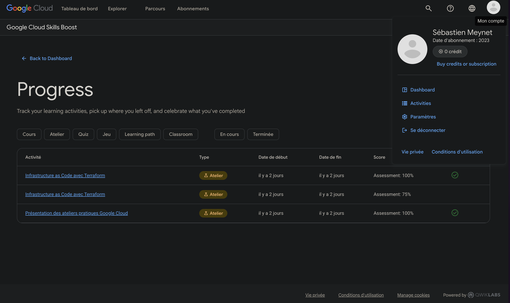

# Cloud-Project 2024-2025

### Fractional Property Ownership System (PropertyStake - Real Estate)

A cloud-native system enabling fractional ownership of real estate properties. Built with Kubernetes, Istio, and NestJS microservices.

---

## Key Features

- **Role-Based Access**: Investors and agents with distinct permissions.
- **Automated Payments**: Integration with Stripe for transactions.
- **Persistent Storage**: PostgreSQL with Kubernetes `StatefulSet`.
- **Scalability**: Microservices orchestrated via Kubernetes and Istio.
- **Security**: RBAC, HTTPS (Let’s Encrypt), and Istio mTLS.

---

## Technical Architecture


- **Backend**: NestJS microservices.
- **Database**: PostgreSQL with persistent volumes.
- **Infrastructure**: Docker, Kubernetes (Minikube), Istio.
- **Security**: JWT, RBAC, cert-manager.
- **Monitoring**: Istio Kiali and Prometheus.

---

## Setup Guide

### 1. Prerequisites

- Install [Docker](https://docs.docker.com/get-docker/), [Minikube](https://minikube.sigs.k8s.io/docs/start/), [kubectl](https://kubernetes.io/docs/tasks/tools/), and [Istio](https://istio.io/latest/docs/setup/getting-started/).

### 2. Start Minikube

```bash
minikube start --driver=docker
minikube addons enable ingress
```

### 3. Clone the Repository

```bash
git clone https://github.com/Mr-R-b0t/Cloud-Project.git
cd cloud-project
```

### 4. Deploy to Kubernetes

```bash
# Deploy PostgreSQL
kubectl apply -f kubernetes/postgres/

# Deploy Microservices
kubectl apply -f kubernetes/services/

# Deploy Istio Configurations
kubectl apply -f kubernetes/istio/

# Deploy Security Policies
kubectl apply -f kubernetes/security/
```

### 5. See the pods running

```bash
kubectl get pods
```

### 6. Access the deployed project

The project is accessible at `http://185.216.27.159`.

### Postman Collection:

- [PostMan Collection](SSA-Project.postman_collection.json)

### 7. Labs verification





### Contributors:

- [Cédric YOGANATHAN](https://github.com/Cyb0nix)
- [Sébastien MEYNET](https://github.com/Mr-R-b0t)
- [Adriaan MEULENBELT-ZUMER](https://github.com/Edran0111)
